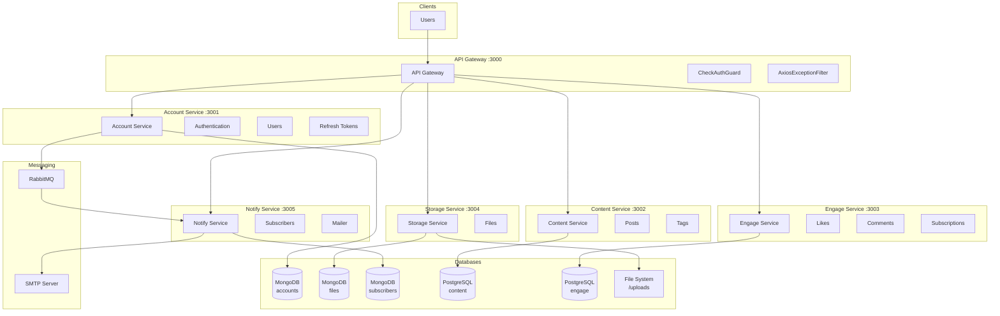

# Архитектура микросервисов Readme

## Общая схема архитектуры

```
┌─────────────────────────────────────────────────────────────────────────────────────────────────────┐
│                                    Микросервисная архитектура "Readme"                               │
└─────────────────────────────────────────────────────────────────────────────────────────────────────┘

     ┌──────────┐
     │          │
     │  Users   │
     │          │
     └────┬─────┘
          │
          │ HTTP Requests
          ▼
┌─────────────────────────────────────────────────────────────────────────────────────────────────────┐
│                                                                                                     │
│                                    ┌─────────────────────────┐                                      │
│                                    │      API GATEWAY        │                                      │
│                                    │      (Port: 3000)       │                                      │
│                                    │                         │                                      │
│                                    │  • CheckAuthGuard       │                                      │
│                                    │  • AxiosExceptionFilter │                                      │
│                                    │  • InjectUserIdIntercep │                                      │
│                                    │  • Swagger /api         │                                      │
│                                    └───────────┬─────────────┘                                      │
│                                                │                                                     │
│         ┌──────────────────┬───────────────────┼───────────────────┬──────────────────┐             │
│         │                  │                   │                   │                  │             │
│         ▼                  ▼                   ▼                   ▼                  ▼             │
│  ┌─────────────┐   ┌─────────────┐     ┌─────────────┐     ┌─────────────┐    ┌─────────────┐      │
│  │   ACCOUNT   │   │   CONTENT   │     │   ENGAGE    │     │   STORAGE   │    │   NOTIFY    │      │
│  │   SERVICE   │   │   SERVICE   │     │   SERVICE   │     │   SERVICE   │    │   SERVICE   │      │
│  │ (Port:3001) │   │ (Port:3002) │     │ (Port:3003) │     │ (Port:3004) │    │ (Port:3005) │      │
│  └──────┬──────┘   └──────┬──────┘     └──────┬──────┘     └──────┬──────┘    └──────┬──────┘      │
│         │                 │                   │                   │                  │             │
│         ▼                 ▼                   ▼                   ▼                  │             │
│    ┌─────────┐       ┌─────────┐         ┌─────────┐         ┌─────────┐             │             │
│    │ MongoDB │       │Postgres │         │Postgres │         │ MongoDB │             │             │
│    │ :27017  │       │ :5433   │         │ :5434   │         │ :27018  │             │             │
│    └─────────┘       └─────────┘         └─────────┘         └─────────┘             │             │
│                                                                    │                 │             │
│                                                              ┌─────────┐             │             │
│                                                              │  File   │             │             │
│                                                              │ System  │             │             │
│                                                              │/uploads │             │             │
│                                                              └─────────┘             │             │
│                                                                                      │             │
│                                                                                      ▼             │
│                                    ┌──────────────────────────────────────────────────────┐        │
│                                    │                    RabbitMQ                          │        │
│                                    │                   (Port: 5672)                       │        │
│                                    │                                                      │        │
│                                    │  Queue: readme.notify.income                         │        │
│                                    └──────────────────────────────────────────────────────┘        │
│                                                         │                                          │
│                                                         ▼                                          │
│                                                   ┌─────────────┐                                  │
│                                                   │   SMTP      │                                  │
│                                                   │  (Email)    │                                  │
│                                                   └─────────────┘                                  │
│                                                                                                     │
└─────────────────────────────────────────────────────────────────────────────────────────────────────┘
```

---

## Детальная схема микросервисов

### 1. Account-Service

```
┌───────────────────────────────────────────────────────────────────────────┐
│                           ACCOUNT-SERVICE                                 │
│                            (Port: 3001)                                   │
├───────────────────────────────────────────────────────────────────────────┤
│                                                                           │
│  ┌─────────────────────────────────────────────────────────────────────┐  │
│  │                        ФУНКЦИОНАЛЬНОСТЬ                             │  │
│  ├─────────────────────────────────────────────────────────────────────┤  │
│  │  • Регистрация пользователей (POST /auth/register)                  │  │
│  │  • Авторизация (POST /auth/login)                                   │  │
│  │  • Проверка токена (POST /auth/check)                               │  │
│  │  • Обновление токенов (POST /auth/refresh)                          │  │
│  │  • Смена пароля (PATCH /auth/password)                              │  │
│  │  • Получение пользователя (GET /auth/user/:id)                      │  │
│  └─────────────────────────────────────────────────────────────────────┘  │
│                                                                           │
│  ┌─────────────────────────────────────────────────────────────────────┐  │
│  │                          МОДУЛИ                                     │  │
│  ├─────────────────────────────────────────────────────────────────────┤  │
│  │  • AuthenticationModule                                             │  │
│  │  • BlogUserModule                                                   │  │
│  │  • RefreshTokenModule                                               │  │
│  │  • NotifyModule (RabbitMQ producer)                                 │  │
│  └─────────────────────────────────────────────────────────────────────┘  │
│                                                                           │
│  ┌─────────────────────────────────────────────────────────────────────┐  │
│  │                         GUARDS                                      │  │
│  ├─────────────────────────────────────────────────────────────────────┤  │
│  │  • LocalAuthGuard      → LocalStrategy (email/password)             │  │
│  │  • JwtAuthGuard        → JwtAccessStrategy (access token)           │  │
│  │  • JwtRefreshGuard     → JwtRefreshStrategy (refresh token)         │  │
│  └─────────────────────────────────────────────────────────────────────┘  │
│                                                                           │
│                              │                                            │
│                              ▼                                            │
│  ┌─────────────────────────────────────────────────────────────────────┐  │
│  │                      MongoDB (accounts)                             │  │
│  └─────────────────────────────────────────────────────────────────────┘  │
│                                                                           │
└───────────────────────────────────────────────────────────────────────────┘
```

#### Сущности Account-Service (MongoDB)

```
┌─────────────────────────────────────────┐    ┌─────────────────────────────────────────┐
│           BlogUser (accounts)           │    │      RefreshToken (refresh-sessions)    │
├─────────────────────────────────────────┤    ├─────────────────────────────────────────┤
│  _id          : ObjectId (PK)           │    │  _id          : ObjectId (PK)           │
│  email        : String (unique)         │    │  tokenId      : String (UUID)           │
│  firstname    : String                  │    │  userId       : String (User._id)       │
│  lastname     : String                  │    │  expiresIn    : Date                    │
│  passwordHash : String (bcrypt)         │    │  createdAt    : Date                    │
│  avatar       : String (file URL)       │    │  updatedAt    : Date                    │
│  dateOfBirth  : Date                    │    └─────────────────────────────────────────┘
│  createdAt    : Date                    │
│  updatedAt    : Date                    │
└─────────────────────────────────────────┘
```

---

### 2. Content-Service

```
┌───────────────────────────────────────────────────────────────────────────┐
│                           CONTENT-SERVICE                                 │
│                            (Port: 3002)                                   │
├───────────────────────────────────────────────────────────────────────────┤
│                                                                           │
│  ┌─────────────────────────────────────────────────────────────────────┐  │
│  │                        ФУНКЦИОНАЛЬНОСТЬ                             │  │
│  ├─────────────────────────────────────────────────────────────────────┤  │
│  │  • CRUD публикаций (POST/GET/PATCH/DELETE /posts)                   │  │
│  │  • Список публикаций с пагинацией (GET /posts)                      │  │
│  │  • Фильтрация по типу, тегу, автору                                 │  │
│  │  • Сортировка (дата, лайки, комментарии)                            │  │
│  │  • Поиск по заголовку (GET /posts/search/:query)                    │  │
│  │  • Черновики пользователя (GET /posts/drafts/:userId)               │  │
│  │  • Лента пользователя (POST /posts/feed)                            │  │
│  │  • Репосты (POST /posts/:id/repost)                                 │  │
│  │  • Количество постов пользователя (GET /posts/count/:userId)        │  │
│  └─────────────────────────────────────────────────────────────────────┘  │
│                                                                           │
│  ┌─────────────────────────────────────────────────────────────────────┐  │
│  │                          МОДУЛИ                                     │  │
│  ├─────────────────────────────────────────────────────────────────────┤  │
│  │  • PostApiModule                                                    │  │
│  │  • PostModule (Repository, Factory, Entity)                         │  │
│  │  • TagModule                                                        │  │
│  │  • PrismaClientModule                                               │  │
│  └─────────────────────────────────────────────────────────────────────┘  │
│                                                                           │
│  ┌─────────────────────────────────────────────────────────────────────┐  │
│  │                      ТИПЫ ПУБЛИКАЦИЙ                                │  │
│  ├─────────────────────────────────────────────────────────────────────┤  │
│  │  • VIDEO  → title, videoUrl (YouTube)                               │  │
│  │  • TEXT   → title, announcement, text                               │  │
│  │  • QUOTE  → quoteText, quoteAuthor                                  │  │
│  │  • PHOTO  → photoUrl                                                │  │
│  │  • LINK   → linkUrl, linkDescription                                │  │
│  └─────────────────────────────────────────────────────────────────────┘  │
│                                                                           │
│                              │                                            │
│                              ▼                                            │
│  ┌─────────────────────────────────────────────────────────────────────┐  │
│  │                  PostgreSQL (readme-content)                        │  │
│  └─────────────────────────────────────────────────────────────────────┘  │
│                                                                           │
└───────────────────────────────────────────────────────────────────────────┘
```

#### Сущности Content-Service (PostgreSQL)

```
┌─────────────────────────────────────────┐    ┌─────────────────────────────────────────┐
│              Post (posts)               │    │              Tag (tags)                 │
├─────────────────────────────────────────┤    ├─────────────────────────────────────────┤
│  id              : UUID (PK)            │    │  id   : UUID (PK)                       │
│  type            : PostType (enum)      │    │  name : String (unique)                 │
│  status          : PostStatus (enum)    │    └─────────────────────────────────────────┘
│  userId          : String               │
│  title           : String (nullable)    │    ┌─────────────────────────────────────────┐
│  extraFields     : JSON                 │    │          _PostToTag (M:N)               │
│  isRepost        : Boolean              │    ├─────────────────────────────────────────┤
│  originalPostId  : String (nullable)    │    │  A : Post.id (FK)                       │
│  originalUserId  : String (nullable)    │    │  B : Tag.id (FK)                        │
│  createdAt       : DateTime             │    └─────────────────────────────────────────┘
│  publishedAt     : DateTime             │
│  tags            : Tag[] (relation)     │
└─────────────────────────────────────────┘

┌─────────────────────────────────────────────────────────────────────────┐
│                              PostType (enum)                            │
├─────────────────────────────────────────────────────────────────────────┤
│  VIDEO | TEXT | QUOTE | PHOTO | LINK                                    │
└─────────────────────────────────────────────────────────────────────────┘

┌─────────────────────────────────────────────────────────────────────────┐
│                             PostStatus (enum)                           │
├─────────────────────────────────────────────────────────────────────────┤
│  PUBLISHED | DRAFT                                                      │
└─────────────────────────────────────────────────────────────────────────┘

┌─────────────────────────────────────────────────────────────────────────┐
│                         extraFields (JSON)                              │
├─────────────────────────────────────────────────────────────────────────┤
│  VIDEO: { "videoUrl": "https://youtube.com/watch?v=..." }               │
│  TEXT:  { "announcement": "...", "text": "..." }                        │
│  QUOTE: { "quoteText": "...", "quoteAuthor": "..." }                    │
│  PHOTO: { "photoUrl": "/uploads/2024/12/uuid.jpg" }                     │
│  LINK:  { "linkUrl": "https://...", "linkDescription": "..." }          │
└─────────────────────────────────────────────────────────────────────────┘
```

---

### 3. Engage-Service

```
┌───────────────────────────────────────────────────────────────────────────┐
│                            ENGAGE-SERVICE                                 │
│                             (Port: 3003)                                  │
├───────────────────────────────────────────────────────────────────────────┤
│                                                                           │
│  ┌─────────────────────────────────────────────────────────────────────┐  │
│  │                        ФУНКЦИОНАЛЬНОСТЬ                             │  │
│  ├─────────────────────────────────────────────────────────────────────┤  │
│  │                                                                     │  │
│  │  ЛАЙКИ:                                                             │  │
│  │  • Toggle лайк (POST /likes/:postId)                                │  │
│  │  • Количество лайков (GET /likes/:postId/count)                     │  │
│  │  • Проверка лайка (GET /likes/:postId/check)                        │  │
│  │  • Удаление лайков поста (DELETE /likes/:postId)                    │  │
│  │                                                                     │  │
│  │  КОММЕНТАРИИ:                                                       │  │
│  │  • Создание комментария (POST /comments/:postId)                    │  │
│  │  • Список комментариев (GET /comments/:postId)                      │  │
│  │  • Количество комментариев (GET /comments/:postId/count)            │  │
│  │  • Удаление комментария (DELETE /comments/:commentId)               │  │
│  │  • Удаление всех комментариев поста (DELETE /comments/post/:postId) │  │
│  │                                                                     │  │
│  │  ПОДПИСКИ:                                                          │  │
│  │  • Подписаться (POST /subscriptions/:userId)                        │  │
│  │  • Отписаться (DELETE /subscriptions/:userId)                       │  │
│  │  • Список подписок (GET /subscriptions/:userId/following)           │  │
│  │  • Список подписчиков (GET /subscriptions/:userId/followers)        │  │
│  │  • Количество подписчиков (GET /subscriptions/:userId/followers/cnt)│  │
│  │  • Проверка подписки (GET /subscriptions/check)                     │  │
│  └─────────────────────────────────────────────────────────────────────┘  │
│                                                                           │
│  ┌─────────────────────────────────────────────────────────────────────┐  │
│  │                          МОДУЛИ                                     │  │
│  ├─────────────────────────────────────────────────────────────────────┤  │
│  │  • LikeApiModule        • LikeModule                                │  │
│  │  • CommentApiModule     • CommentModule                             │  │
│  │  • SubscriptionApiModule • SubscriptionModule                       │  │
│  │  • PrismaClientModule                                               │  │
│  └─────────────────────────────────────────────────────────────────────┘  │
│                                                                           │
│                              │                                            │
│                              ▼                                            │
│  ┌─────────────────────────────────────────────────────────────────────┐  │
│  │                  PostgreSQL (readme-engage)                         │  │
│  └─────────────────────────────────────────────────────────────────────┘  │
│                                                                           │
└───────────────────────────────────────────────────────────────────────────┘
```

#### Сущности Engage-Service (PostgreSQL)

```
┌─────────────────────────────────────────┐
│              Like (likes)               │
├─────────────────────────────────────────┤
│  id        : UUID (PK)                  │
│  postId    : String                     │
│  userId    : String                     │
│  createdAt : DateTime                   │
├─────────────────────────────────────────┤
│  UNIQUE (postId, userId)                │
│  INDEX (postId)                         │
│  INDEX (userId)                         │
└─────────────────────────────────────────┘

┌─────────────────────────────────────────┐
│           Comment (comments)            │
├─────────────────────────────────────────┤
│  id        : UUID (PK)                  │
│  postId    : String                     │
│  userId    : String                     │
│  text      : String (10-300 chars)      │
│  createdAt : DateTime                   │
├─────────────────────────────────────────┤
│  INDEX (postId)                         │
│  INDEX (userId)                         │
└─────────────────────────────────────────┘

┌─────────────────────────────────────────┐
│      Subscription (subscriptions)       │
├─────────────────────────────────────────┤
│  id          : UUID (PK)                │
│  followerId  : String (кто подписался)  │
│  followingId : String (на кого)         │
│  createdAt   : DateTime                 │
├─────────────────────────────────────────┤
│  UNIQUE (followerId, followingId)       │
│  INDEX (followerId)                     │
│  INDEX (followingId)                    │
└─────────────────────────────────────────┘
```

---

### 4. Storage-Service

```
┌───────────────────────────────────────────────────────────────────────────┐
│                            STORAGE-SERVICE                                │
│                             (Port: 3004)                                  │
├───────────────────────────────────────────────────────────────────────────┤
│                                                                           │
│  ┌─────────────────────────────────────────────────────────────────────┐  │
│  │                        ФУНКЦИОНАЛЬНОСТЬ                             │  │
│  ├─────────────────────────────────────────────────────────────────────┤  │
│  │  • Загрузка файла (POST /files/upload)                              │  │
│  │  • Получение информации о файле (GET /files/:fileId)                │  │
│  │  • Раздача статических файлов (GET /static/*)                       │  │
│  └─────────────────────────────────────────────────────────────────────┘  │
│                                                                           │
│  ┌─────────────────────────────────────────────────────────────────────┐  │
│  │                          МОДУЛИ                                     │  │
│  ├─────────────────────────────────────────────────────────────────────┤  │
│  │  • FileUploaderApiModule                                            │  │
│  │  • FileUploaderModule (Repository, Factory, Entity)                 │  │
│  │  • ServeStaticModule (/static → /uploads)                           │  │
│  └─────────────────────────────────────────────────────────────────────┘  │
│                                                                           │
│  ┌─────────────────────────────────────────────────────────────────────┐  │
│  │                      ОГРАНИЧЕНИЯ                                    │  │
│  ├─────────────────────────────────────────────────────────────────────┤  │
│  │  • Аватары: до 500 КБ, jpg/png                                      │  │
│  │  • Фото для постов: до 1 МБ, jpg/png                                │  │
│  └─────────────────────────────────────────────────────────────────────┘  │
│                                                                           │
│                    │                           │                          │
│                    ▼                           ▼                          │
│  ┌──────────────────────────┐   ┌──────────────────────────┐             │
│  │   MongoDB (file-storage) │   │     File System          │             │
│  │   (метаданные)           │   │     /uploads/YYYY/MM/    │             │
│  └──────────────────────────┘   └──────────────────────────┘             │
│                                                                           │
└───────────────────────────────────────────────────────────────────────────┘
```

#### Сущности Storage-Service

```
┌─────────────────────────────────────────┐    ┌─────────────────────────────────────────┐
│       File (MongoDB: files)             │    │       File System Structure             │
├─────────────────────────────────────────┤    ├─────────────────────────────────────────┤
│  _id          : ObjectId (PK)           │    │  /uploads/                              │
│  originalName : String                  │    │    └── 2024/                            │
│  hashName     : String (UUID.ext)       │    │        └── 12/                          │
│  mimetype     : String (image/jpeg)     │    │            ├── a1b2c3d4.jpg             │
│  size         : Number (bytes)          │    │            └── b2c3d4e5.png             │
│  path         : String (full path)      │    └─────────────────────────────────────────┘
│  subDirectory : String (YYYY/MM)        │
│  createdAt    : Date                    │
│  updatedAt    : Date                    │
└─────────────────────────────────────────┘
```

---

### 5. Notify-Service

```
┌───────────────────────────────────────────────────────────────────────────┐
│                            NOTIFY-SERVICE                                 │
│                             (Port: 3005)                                  │
├───────────────────────────────────────────────────────────────────────────┤
│                                                                           │
│  ┌─────────────────────────────────────────────────────────────────────┐  │
│  │                        ФУНКЦИОНАЛЬНОСТЬ                             │  │
│  ├─────────────────────────────────────────────────────────────────────┤  │
│  │  • Добавление подписчика (через RabbitMQ)                           │  │
│  │  • Рассылка уведомлений о новых постах (POST /notify/send)          │  │
│  │  • Отправка email через SMTP                                        │  │
│  └─────────────────────────────────────────────────────────────────────┘  │
│                                                                           │
│  ┌─────────────────────────────────────────────────────────────────────┐  │
│  │                          МОДУЛИ                                     │  │
│  ├─────────────────────────────────────────────────────────────────────┤  │
│  │  • EmailSubscriberApiModule (RabbitMQ consumer)                     │  │
│  │  • EmailSubscriberModule (Repository, Factory, Entity)              │  │
│  │  • MailModule (Handlebars templates)                                │  │
│  │  • MailerModule (Nodemailer)                                        │  │
│  └─────────────────────────────────────────────────────────────────────┘  │
│                                                                           │
│  ┌─────────────────────────────────────────────────────────────────────┐  │
│  │                     EMAIL ШАБЛОНЫ                                   │  │
│  ├─────────────────────────────────────────────────────────────────────┤  │
│  │  • add-subscriber.hbs  → Приветственное письмо                      │  │
│  │  • new-posts.hbs       → Уведомление о новых публикациях            │  │
│  └─────────────────────────────────────────────────────────────────────┘  │
│                                                                           │
│        ┌───────────────────────────────────────────────────────┐         │
│        │                    RabbitMQ                           │         │
│        │          Queue: readme.notify.income                  │         │
│        │                                                       │         │
│        │  Message: { email, firstname, lastname }              │         │
│        │  (при регистрации нового пользователя)                │         │
│        └───────────────────────────────────────────────────────┘         │
│                              │                                            │
│                    ┌─────────┴─────────┐                                  │
│                    ▼                   ▼                                  │
│  ┌──────────────────────────┐   ┌──────────────────────────┐             │
│  │   MongoDB (subscribers)  │   │        SMTP Server       │             │
│  └──────────────────────────┘   │    (nodemailer)          │             │
│                                 └──────────────────────────┘             │
│                                                                           │
└───────────────────────────────────────────────────────────────────────────┘
```

#### Сущности Notify-Service (MongoDB)

```
┌─────────────────────────────────────────┐
│   EmailSubscriber (email-subscribers)   │
├─────────────────────────────────────────┤
│  _id        : ObjectId (PK)             │
│  email      : String (unique)           │
│  firstname  : String                    │
│  lastname   : String                    │
│  lastSentAt : Date (nullable)           │
│  createdAt  : Date                      │
│  updatedAt  : Date                      │
└─────────────────────────────────────────┘
```

---

## Связи между сервисами

```
┌─────────────────────────────────────────────────────────────────────────────────────────┐
│                              ВЗАИМОДЕЙСТВИЕ СЕРВИСОВ                                    │
└─────────────────────────────────────────────────────────────────────────────────────────┘

┌─────────────────┐                                            ┌─────────────────┐
│  API Gateway    │──── HTTP ────────────────────────────────>│ Account-Service │
│                 │<─── {user, tokens} ──────────────────────│                 │
│                 │                                            │                 │
│                 │                                            │        │        │
│                 │                                            │        │        │
│                 │                                            │   RabbitMQ      │
│                 │                                            │        │        │
│                 │                                            │        ▼        │
│                 │                                            │ ┌─────────────┐ │
│                 │                                            │ │Notify-Service│
│                 │                                            │ └─────────────┘ │
│                 │                                            └─────────────────┘
│                 │
│                 │──── HTTP (with userId) ─────────────────>┌─────────────────┐
│                 │<─── {posts, pagination} ────────────────│ Content-Service │
│                 │                                           └─────────────────┘
│                 │
│                 │──── HTTP (with userId) ─────────────────>┌─────────────────┐
│                 │<─── {likes, comments, subscriptions} ───│  Engage-Service │
│                 │                                           └─────────────────┘
│                 │
│                 │──── HTTP (multipart/form-data) ────────>┌─────────────────┐
│                 │<─── {fileId, path} ─────────────────────│ Storage-Service │
└─────────────────┘                                           └─────────────────┘


┌─────────────────────────────────────────────────────────────────────────────────────────┐
│                               ПОТОКИ ДАННЫХ                                             │
├─────────────────────────────────────────────────────────────────────────────────────────┤
│                                                                                         │
│  1. РЕГИСТРАЦИЯ:                                                                        │
│     Client → API Gateway → Account-Service → MongoDB                                    │
│                                    ↓                                                    │
│                               RabbitMQ → Notify-Service → MongoDB (subscriber)          │
│                                                                                         │
│  2. СОЗДАНИЕ ПОСТА:                                                                     │
│     Client → API Gateway [CheckAuthGuard] → Account-Service [verify token]              │
│                    ↓                                                                    │
│              Content-Service → PostgreSQL (post + tags)                                 │
│                                                                                         │
│  3. ЛАЙК ПОСТА:                                                                         │
│     Client → API Gateway [CheckAuthGuard] → Account-Service [verify token]              │
│                    ↓                                                                    │
│              Engage-Service → PostgreSQL (like)                                         │
│                                                                                         │
│  4. ЛЕНТА ПОЛЬЗОВАТЕЛЯ:                                                                 │
│     Client → API Gateway [CheckAuthGuard] → Account-Service [verify token]              │
│                    ↓                                                                    │
│              Engage-Service [get following IDs] → Content-Service [get posts by IDs]    │
│                                                                                         │
│  5. РАССЫЛКА УВЕДОМЛЕНИЙ:                                                               │
│     Admin → API Gateway → Notify-Service → Content-Service [get new posts]              │
│                                   ↓                                                     │
│                             SMTP → Email to all subscribers                             │
│                                                                                         │
└─────────────────────────────────────────────────────────────────────────────────────────┘
```

---

## Mermaid диаграмма

Для визуализации в инструментах, поддерживающих Mermaid:



